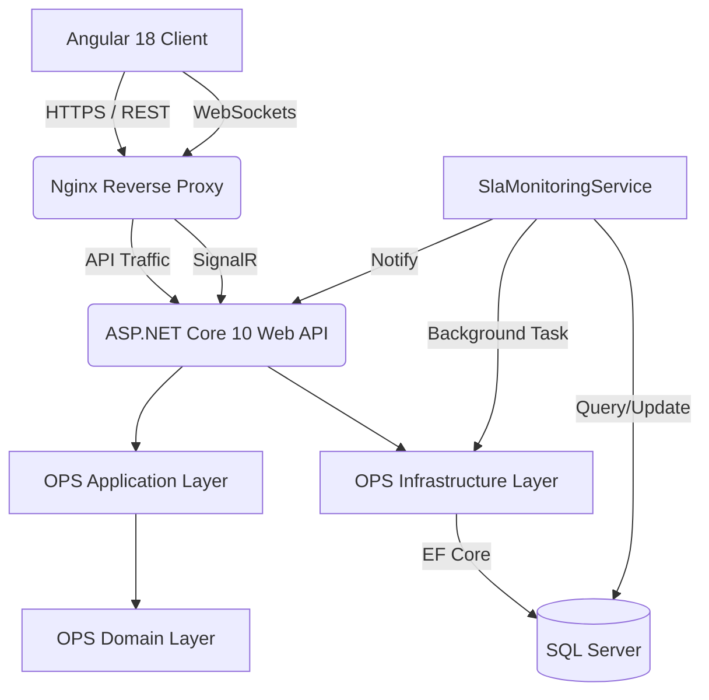

<div align="center">
  <h1>🚨 OPS - Incident & Operations Management</h1>
  
  <h3>Track • Collaborate • Resolve</h3>
  <p><em>A highly-scalable, real-time enterprise incident management and operations platform.</em></p>
  
  <p>
    
    
    
    
  </p>
  <p>
    
  </p>
  
  <p><em>Real-Time • Secure • Enterprise-Grade</em></p>
</div>

<hr>

## 📖 Overview

**OPS** (Operations Pluse System) is a complete, real-time enterprise application designed to track, manage, and resolve critical incidents. Built with **Clean Architecture**, **Domain-Driven Design (DDD)**, and **CQRS principles**, it provides unparalleled visibility, collaboration, and SLA enforcement for global engineering and operations teams.

---

## 🎯 Why OPS?

Traditional ticketing systems are often slow, require manual page refreshes, and lack integrated, targeted SLA engines. **OPS** solves these problems by providing:
- **Real-Time Collaboration**: Instant notifications and updates without refreshing the page, powered by SignalR.
- **Automated SLAs**: System-driven Service Level Agreement (SLA) monitoring that automatically warns and escalates critical issues.
- **Enterprise RBAC**: Proper team-based scoping so responders only see what they are assigned to, and managers oversee their teams.
- **Rich Analytics**: True SQL-backed operational intelligence. No mock data.

---

## ✨ Features

- **Real-Time Dashboards**: Watch incidents change state instantly across your entire organization.
- **SLA Engine**: Automated background workers track Response and Resolution deadlines with precision.
- **Team Scoping**: Deeply integrated authorization ensuring users only access incidents relevant to their teams.
- **Incident Collaboration**: Comment feeds and secure file attachments (up to 10MB) per incident.
- **Activity Timeline**: Unified chronological timeline for all incident events (status changes, SLA breaches, comments).
- **JWT Security**: Robust token-based authentication and endpoint security.
- **Containerized**: Fully Dockerized for seamless deployment and horizontal scaling.

---

## 👥 Roles

The platform enforces strict Role-Based Access Control (RBAC):

- **Admin**: Global access to the entire OPS platform. Manages teams, users, and oversees all incidents.
- **Manager**: Belongs to one or more authorized Teams. Oversees team performance, assigns incidents, and monitors analytics.
- **Responder**: The frontline engineer. Assigned to specific incidents to provide resolution and technical updates.
- **Reporter**: Users who raise incidents. Can track the status of their own reported issues and communicate with the resolution team.

---

## 🔄 Incident Lifecycle

1. **New**: An incident is created by a Reporter and assigned a unique `TrackingId` (e.g., `INC-1004`). SLA clocks start ticking.
2. **Open**: A Manager reviews the incident and assigns it to a Responder.
3. **In Progress**: The Responder acknowledges the incident, satisfying the **Response SLA**.
4. **Resolved**: The Responder provides a fix, satisfying the **Resolution SLA**.
5. **Closed**: The incident is permanently archived.
6. *(Alternative)* **Escalated**: If the Resolution SLA is breached, the system automatically escalates the incident and notifies all stakeholders.

---

## 🏛️ Architecture

OPS is built using **Clean Architecture** to ensure the core business logic is completely isolated from frameworks and external concerns.



---

## 💻 Technology Stack

### Frontend
- **Angular 18** (Standalone Components)
- **Angular Material** (Premium UI Components)
- **RxJS** (Reactive State Management)
- **Chart.js / ng2-charts** (Data Visualization)

### Backend
- **.NET 10** (ASP.NET Core Web API)
- **Entity Framework Core 10** (ORM)
- **SignalR** (Real-Time WebSockets)
- **BCrypt** (Password Hashing)
- **JWT** (Authentication)

### Infrastructure
- **SQL Server 2022** (Relational Database)
- **Docker & Docker Compose** (Containerization)
- **Nginx** (Web Server & Reverse Proxy)

---

## ⚡ Real-Time Architecture

The system utilizes a heavily abstracted **SignalR** implementation to ensure real-time capabilities do not bleed into business logic.
- **Targeted Delivery**: Notifications are routed exclusively to authenticated `UserId`s. Private data is never broadcast globally.
- **Idempotency**: SignalR failures do not roll back database commits.
- **Debouncing**: Analytics dashboards use RxJS debounce techniques to efficiently process bursts of real-time events.

---

## ⏱️ SLA Architecture

The SLA Engine (`SlaMonitoringService`) runs as an isolated background hosted service.
- Continuously evaluates active incidents against configured Response and Resolution SLA policies.
- Automatically generates pre-breach warnings at 80% threshold.
- Automatically escalates incidents and logs historical audit trails upon SLA breach.
- Persists all SLA state changes transactionally in SQL Server before attempting real-time delivery.

---

## 📊 Analytics

The OPS dashboard is driven entirely by the backend SQL Server. It aggregates:
- **Incident Volume**: Breakdowns by severity and priority.
- **SLA Performance**: Tracking breaches vs. compliances.
- **Team Workload**: Real-time distribution of incidents across managers and responders.
All metrics respect the user's Team and Role scoping rules.

---

## 💬 Collaboration

- **Comments**: Full CRUD operations for incident comments, seamlessly integrated into the Activity Feed.
- **Attachments**: Secure, physical file uploads (JPG, PNG, PDF, DOCX) up to 10MB.
- **Security**: Strict path traversal protection, MIME validation, and extension checking. Download access is gated by the same RBAC rules that govern incident access.

---

## 🐳 Docker

The entire platform is containerized for zero-configuration deployments.
- `ops-db`: SQL Server database with persistent volume.
- `ops-api`: ASP.NET Core backend.
- `ops-web`: Nginx serving the compiled Angular application.
- **Persistent Storage**: Database files and uploaded attachments survive container restarts.

---

## 🗄️ Database

- Structured via EF Core Code-First Migrations.
- Soft-deletion strategies for auditability (e.g., Comments).
- Strict foreign keys and unique constraints (e.g., `UserTeam` uniqueness, `TrackingId` generation).

---

## 🛡️ Security

Security was foundational in the design of OPS:
- Passwords hashed via BCrypt (Work Factor 12).
- API secured via JWT Bearer authentication.
- Centralized `GlobalExceptionMiddleware` prevents stack trace leaks.
- Path traversal and malicious file upload protection on all attachment endpoints.
- Environment variables (`.env`) for secrets management, strictly excluded from version control.

---

## 🧪 Testing

The backend business logic is verified using **xUnit** and **Moq**.
Tests focus on proving critical business invariants:
- TrackingId generation logic.
- JWT Authentication success/failure paths.
- Proper SLA threshold calculations.

---

## 📂 Project Structure

```text
OpsPluse/
├── OPS/
│   ├── ClientApp/            # Angular 18 Frontend
│   ├── OPS.Domain/           # Core Entities & Enums
│   ├── OPS.Application/      # Interfaces & DTOs
│   ├── OPS.Infrastructure/   # EF Core, SignalR, Background Workers
│   ├── OPS.API/              # Controllers, Middleware, Health Checks
│   └── OPS.Tests/            # xUnit Test Suite
├── .env.example              # Template for environment secrets
├── docker-compose.yml        # Orchestration
└── README.md                 # You are here
```

---

## 🚀 Getting Started

1. **Clone the repository.**
2. **Setup Environment**: Copy `.env.example` to `.env` and adjust passwords/secrets.
3. **Build & Run**:
   ```bash
   docker compose up --build
   ```
4. **Access**:
   - Web App: `http://localhost:4200`
   - API Swagger: `http://localhost:5000/swagger`
   - Health Check: `http://localhost:5000/health`

---

## 🔑 Default Development Credentials

Upon first run, EF Core seeding creates the following accounts (Password for all: `Password123`):

- **Admin**: `admin@gms.com`
- **Manager**: `manager@gms.com`
- **Responder**: `responder@gms.com`
- **Reporter**: `reporter@gms.com`

---

## 🛣️ Future Roadmap

- Native Mobile Application integration via REST.
- AI-driven incident summaries and triage suggestions.
- Advanced SLA calendar logic (respecting business hours and holidays).
- Deep integration with Slack and Microsoft Teams.

---

## 📄 License

Proprietary enterprise software. All rights reserved.
